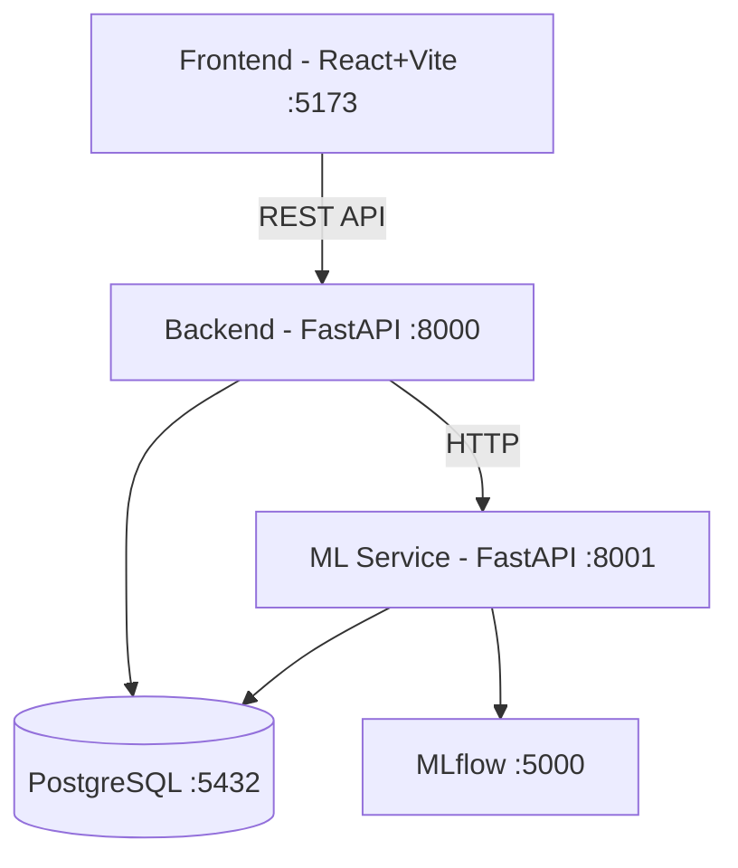

# Walkthrough — MedPredict AI Implementation

## Summary

Đã hoàn thành scaffold toàn bộ hệ thống **MedPredict AI** — hệ thống dự đoán tái nhập viện 30 ngày từ dữ liệu MIMIC-IV Demo. Tổng cộng **~50 files** được tạo mới trên 4 layers.

## Architecture



## Changes Made

### 1. Database Layer (`database/`)
| File | Description |
|------|-------------|
| `init.sql` | Full schema: 7 MIMIC-IV tables + 4 app tables (users, predictions, ml_models, retraining_jobs) |
| `seed_data.sql` | Default admin/doctor users + sample ML model |
| `import_mimic.py` | Python script to import MIMIC-IV CSV → PostgreSQL |

### 2. Backend API (`backend/`)
| File | Description |
|------|-------------|
| `app/main.py` | FastAPI app with CORS + session middleware |
| `app/config.py` | Settings (DB, auth, ML service URLs) |
| `app/database.py` | SQLAlchemy engine + session management |
| `app/models/` | 6 ORM model files (User, Patient, Admission, Clinical×4, Prediction, MLModel) |
| `app/schemas/` | 4 Pydantic schema files |
| `app/routers/` | 5 routers: auth, users, patients, predictions, admin |
| `app/middleware/auth.py` | Session-based authentication |
| `app/utils/security.py` | bcrypt password hashing |

**API Endpoints:**
- `POST /api/auth/login|logout` — Session auth
- `GET /api/patients` — Paginated patient list with search/filter
- `GET /api/patients/{id}` — Patient detail + admissions
- `POST /api/predictions/request` — Run ML prediction
- `GET /api/admin/dashboard` — Dashboard statistics
- `PUT /api/admin/models/{id}/stage` — Model stage management
- `POST /api/admin/retrain` — Trigger retraining

### 3. ML Service (`ml_service/`)
| File | Description |
|------|-------------|
| `app/services/feature_engineering.py` | 15-feature vector builder from MIMIC-IV |
| `app/services/inference.py` | MLflow model loading + SHAP + heuristic fallback |
| `app/services/training_pipeline.py` | Multi-model training (LR, RF, XGBoost) |
| `app/routers/` | predict, training, monitoring endpoints |

### 4. Frontend (`frontend/`)
| Component | Description |
|-----------|-------------|
| `index.css` | 20KB design system — dark medical theme, glassmorphism, animations |
| `AuthContext.jsx` | Session-based auth state management |
| `Layout/` | Sidebar + Header + Layout wrapper |
| `LoginPage.jsx` | Premium login with gradient effects |
| `Dashboard.jsx` | Stat cards + PieChart + BarChart + recent predictions |
| `PatientList.jsx` | DataGrid with search, filter, pagination |
| `PatientDetail.jsx` | Patient info + admission history + clinical details |
| `PredictionRequest.jsx` | Prediction form + risk gauge + SHAP feature chart |
| `PredictionHistory.jsx` | History table with risk filtering |
| `UserManagement.jsx` | Admin CRUD for users |
| `ModelManagement.jsx` | Model cards + stage management + retrain |
| `MonitoringDashboard.jsx` | Risk distribution + daily trends + model metrics |

### 5. Infrastructure
| File | Description |
|------|-------------|
| `docker-compose.yml` | 5 services: postgres, backend, ml_service, mlflow, frontend |
| `.env` / `.env.example` | Environment configuration |
| `README.md` | Project documentation |

## Validation

- ✅ Frontend build: `vite build` — compiled successfully (653 modules)
- ✅ All component imports resolve correctly
- ✅ CSS design system covers all UI patterns

## Next Steps to Run

```bash
# 1. Start all services
docker-compose up --build

# 2. Import MIMIC data (after postgres is ready)
python database/import_mimic.py

# 3. Open browser
# Frontend: http://localhost:5173
# API Docs: http://localhost:8000/api/docs
# MLflow: http://localhost:5000

# 4. Login: admin/admin123
```
